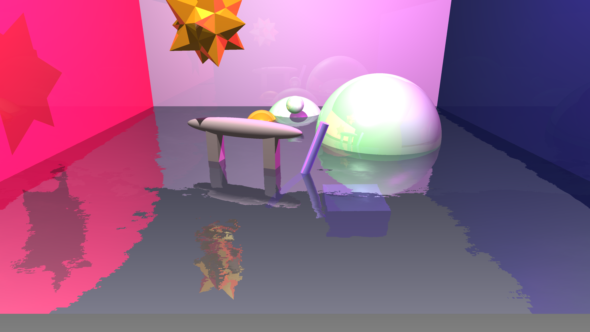
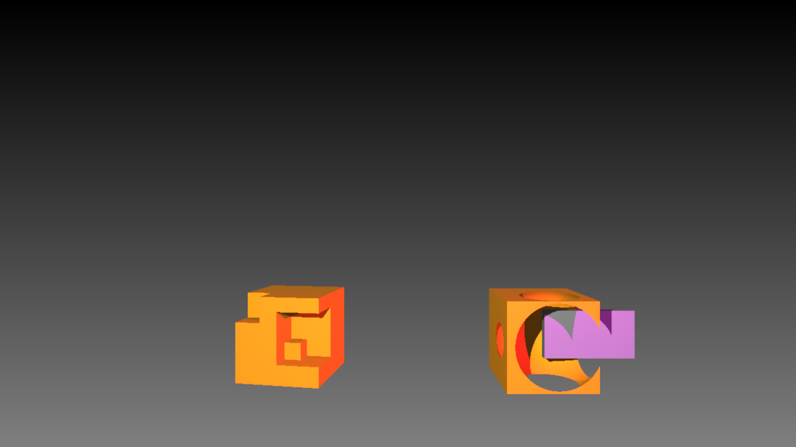
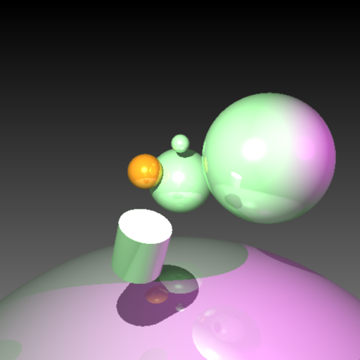

RayTracer Project
====================================================
Robust CPU-based ray tracer. **STAR me** if you find it helpful... ⁽⁽٩(๑˃̶͈̀ ᗨ ˂̶͈́)۶⁾⁾  



_Water_Surface_


_Reflection & Refraction_



_CSG demo_



_Primitive : Cylinder_


Compilation
----------------
```
$ cd RayTracer
$ premake4 gmake
$ make
$ cd src
$ premake4 gmake
$ make
$ ./RayTracer Assets/simple.lua  ## Output: simple.png
```

Supported Features
-------------------------
### Reflection

Recursive reflection w/o distributed rays.

### Refraction

Water refraction looks good.

### Supported Primitives 

sphere, cube, cylinder

### Constructive Solid Geometry

"difference" mode completed.

Now supports hierarchical CSG tree.

"union" mode completed.

### Super Sampling

Take average color of 4 corners of a pixel.

Compare sample.png vs. sample-SSAA.png. Other images do not have super sampling turned on.

### Multi-threading

Supported...

Manual
----------------------
1. When a mesh has no thickness like a surface plane, my implementation still generate a bounding box with epsilon thickness. As a result shown in macho-cows-bb.png, the shadows on the surface plane is overran thus not shown.

Credit
-------------
University of Waterloo Fall 2018 CS488

