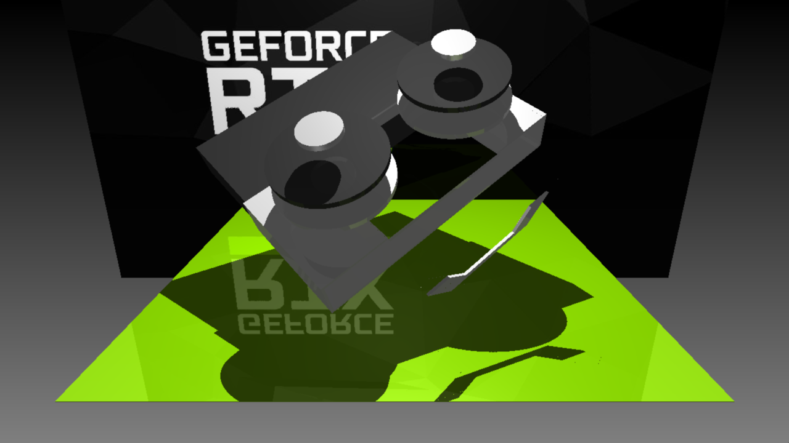
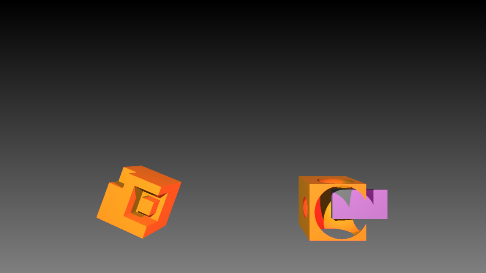

RayTracer Project
====================================================
Robust CPU-based ray tracer. **STAR me** if you find it helpful... ⁽⁽٩(๑˃̶͈̀ ᗨ ˂̶͈́)۶⁾⁾  


_"Water Cool"_


_"RTX 2080"_



_"RTX 2080 Disassambled"_


_Water_Surface_


_Reflection & Refraction (Glass)_



_CSG demo_


_Primitive : Cylinder_


Manual
----------------
```
$ cd RayTracer
$ premake4 gmake
$ make
$ cd src
$ premake4 gmake
$ make
$ ./RayTracer Assets/simple.lua  ## Output: simple.png
```

Final Scene
----------------


Supported Features
-------------------------
### Photon Mapping for Caustics

I performed photon mapping on one surface that is the ground to achieve caustics. Lights are point light and are mainly distorted by the water surface with a normal map in my scene. 

Different to what is suggested in "A Practical Guide to Global Illumination using Photon Maps, Stanford", I collect nearby photons using squares instead of circles. This allows me to just use a 2D array to store a mapping for a surface. The mapping is pre-computed before shading and uses multi-threading for efficiency. 

Totally 36000 photons are been casted, and the patch is a 2.5 units square. Both data is pushed to global to support concurrency.


_Photon Mapping Off_


_Photon Mapping ON_

### A detailed graphics card model

RTX 2080ti


_A Nice Looking Graphics Card_


_Disassemble it to Show it is Constructed by CSG_


### Additional Primitive: cylinder


### Constructive Solid Geometry (CSG)

gr.construct(’name’, ’mode’) returns a ConstructiveNode and is used to perform CSG. ”mode”
option is either one the three ”union”, ”difference”, and ”intersect”. ConstructiveNode only accepts
two children.

For ”difference” whichever child is added first is the solid shape and the other one is the subtraction.
All implementation works except ”intersect” mode.

For ”union” the surfaces inside the CSG should not exist (i.e. they will not be seen when both children
are transparent)

I don’t need to perform intersect in my scene so I did not implement it. However, I know that ”intersect”
is the converse of ”difference”, and I made my code modulized such that ”intersect” mode can be easily
implement if needed.


### Reflection

Recursive reflection with maximum of 6 times

_Reflection Only_:


### Refraction

_Refraction Only_:


_Both Reflection and Refraction_:


### Texture Mapping

Only supports flat surface.


### Bump Mapping


_Water without normal map_


_Water with normal map_

### Spatial Division

Not implemented.

### Multi-threading

Used in both shading and photon mapping.


### Super Sampling

Take average color of 4 corners of a pixel.


_Without Sumper Sampling_


_With Sumper Sampling_


Credit
-------------
University of Waterloo Fall 2018 CS488


**Constructive Solid Geometry**

Peter Shirley: pg.13 10.7 Constructive Solid Geometry

**Recursive Ray Tracing:**

McConnell: 8.2, 8.3. Recursive Ray Tracing

Watt: 12.1. Recursive Ray Tracing

Bram de Greve, Stanford: Reflections and Refractions in Ray Tracing pg.2 - 3

**Refraction:**

Peter Shirley: pg.13 10.7 Refraction

Graphics Codex: Direct Illumination; Transmittion

**Photon Mapping:**

Course Slides: Photon Mapping

A Practical Guide to Global Illumination using Photon Maps, Stanford: pg. 14 - 18 
https://graphics.stanford.edu/course00/course8.pdf
